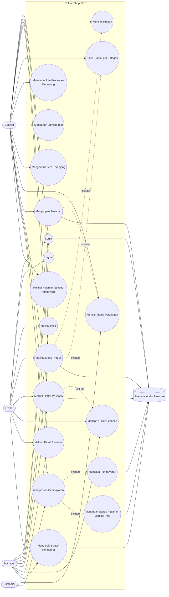
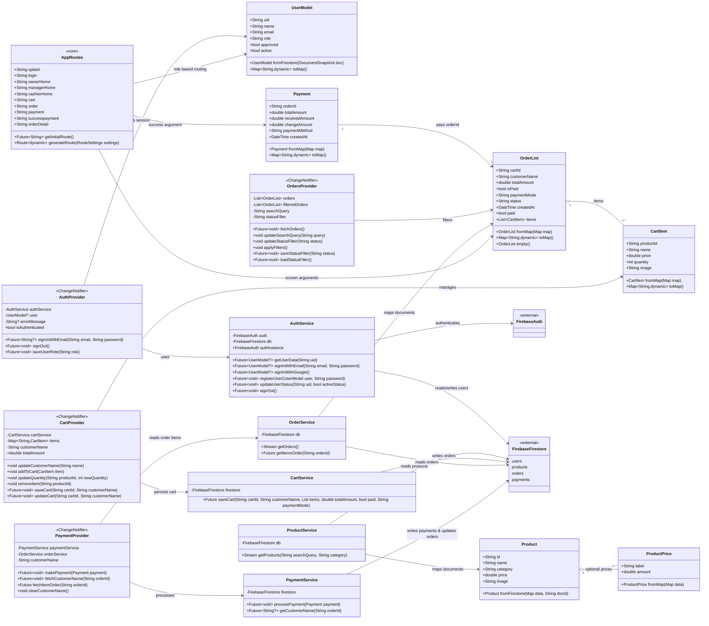
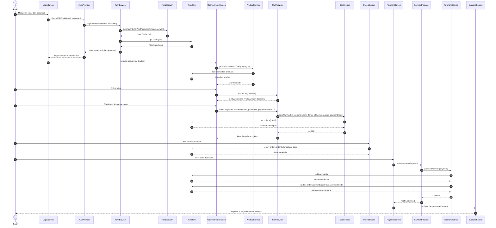
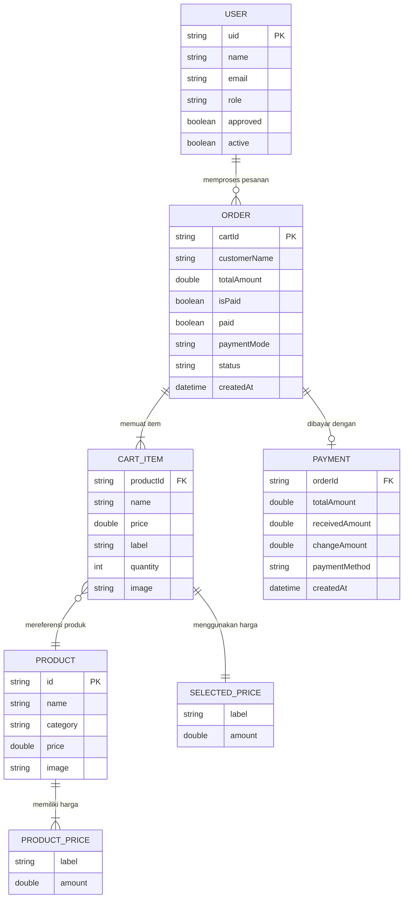

# Diagram UML Coffee Shop POS

Dokumen ini berisi rancangan UML untuk aplikasi **Coffee Shop POS** berdasarkan struktur Flutter, Provider, model, service, dan integrasi Firebase/Firestore yang ada di proyek.

## 1. Use Case Diagram

Diagram ini menggambarkan aktor utama aplikasi dan fitur yang dapat diakses oleh setiap peran.

## 2. Class Diagram

Diagram ini memetakan kelas inti pada layer model, provider, service, routing, dan penyimpanan eksternal.

## 3. Sequence Diagram

Sequence berikut menjelaskan alur transaksi utama: kasir login, memilih produk, menyimpan pesanan, memproses pembayaran, lalu sistem menampilkan pembayaran berhasil.

## 4. Entity Relationship Diagram (ERD)

Diagram ini menggambarkan struktur data yang digunakan pada koleksi Firestore dan relasi antar entitas dalam aplikasi Coffee Shop POS.

